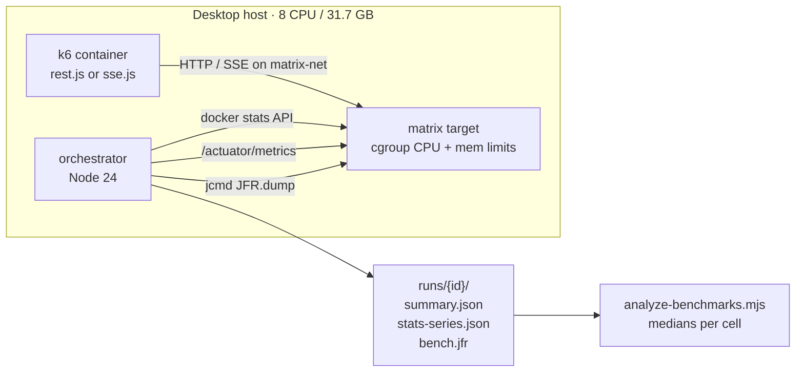
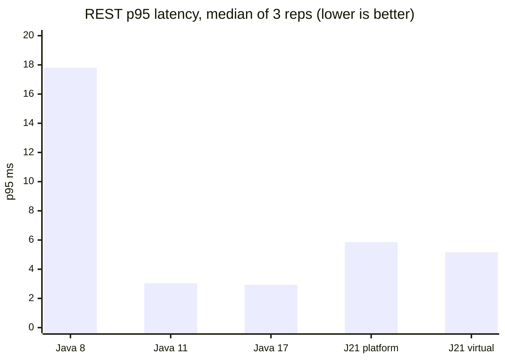
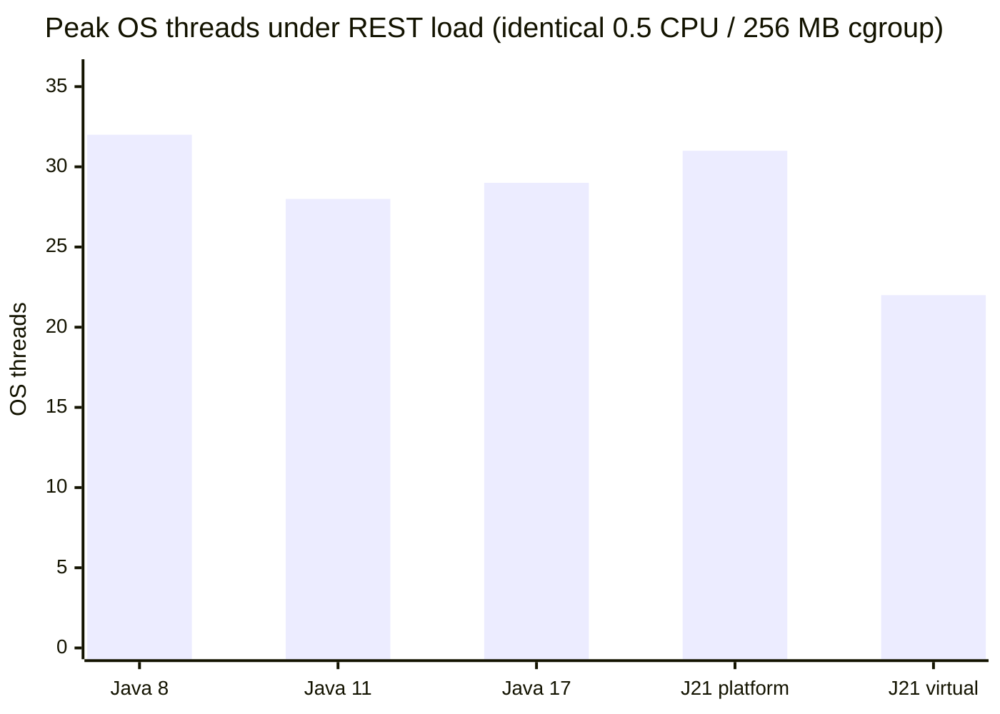

# 12 — Benchmark Report (2026-07-26)

First full sweep of the matrix. **23 measured runs**, ~35 minutes wall clock, produced by
`scripts/run-benchmarks.ps1` and aggregated by `scripts/analyze-benchmarks.mjs`.

> Read §5 before quoting anything from here. Two of the four headline numbers are solid; one is
> high-variance noise, and one earlier claim in `docs/01 §4.2` turned out to be wrong.

---

## 1. Method

- **One target at a time.** Each row is started, benchmarked, then stopped before the next begins, so
  the JVM under test never competes with another JVM for host CPU.
- **Warmup discarded.** Every REST cell runs an unmeasured pass first (JIT compilation, page cache).
- **3 reps per REST cell, 2 per SSE cell**, reported as **medians**. With 3 reps a single slow run
  from background OS work would drag a mean noticeably.
- **Fresh container per target**, so memory figures are not inflated by hours of prior accumulation.
- Host: 8 logical CPUs, 31.7 GB RAM, Docker Engine 29.6.1 (8 CPU / 16.6 GB allocated).
- REST: 10 VUs, 30s, ramp `0:5s,full:20s,0:5s`. SSE: 12 held connections, 20s, `DROP_RATE=0.1`.



### Configurations measured

| Target | Runtime | Shell | Threads | cpus | mem | -Xmx | Measured |
| :-- | :-- | :-- | :-- | :--: | :--: | :--: | :-- |
| java8-platform-low | 1.8.0_492 | Boot 2.7.18 | platform | 0.5 | 256m | 192m | REST + SSE |
| java11-platform-low | 11.0.31 | Boot 2.7.18 | platform | 1.0 | 512m | 384m | REST + SSE |
| java17-platform-mid | 17.0.19 | Boot 4.1.0 | platform | 2.0 | 2g | 1500m | REST |
| java21-platform-low | 21.0.11 | Boot 4.1.0 | platform | 0.5 | 256m | 192m | REST + SSE |
| java21-virtual-low | 21.0.11 | Boot 4.1.0 | **virtual** | 0.5 | 256m | 192m | REST + SSE |

**Only one pair varies exactly one thing:** `java21-platform-low` vs `java21-virtual-low` — same
runtime, same shell, same cgroup, same heap, threading model only. Every other comparison is
confounded, and §5 says by what.

---

## 2. REST results (medians of 3)

| Target | rps | p50 ms | p95 ms | errors | peak mem MB | peak heap MB | OS threads | peak CPU % | ctx-sw /s |
| :-- | --: | --: | --: | --: | --: | --: | --: | --: | --: |
| java8-platform-low | 41.6 | 2.37 | **17.81** | 0 | 154.3 | 35.9 | 32 | 49.2 | 2855 |
| java11-platform-low | 44.0 | 1.44 | 3.03 | 0 | 229.3 | 36.3 | 28 | 48.1 | 594 |
| java17-platform-mid | 44.1 | 1.56 | 2.93 | 0 | 274.2 | 55.9 | 29 | 48.6 | 602 |
| java21-platform-low | 42.9 | 1.44 | 5.86 | 0 | 162.6 | 49.4 | 31 | 17.6 | 1261 |
| java21-virtual-low | 42.4 | 1.46 | 5.16 | 0 | 178.1 | 42.2 | **22** | 30.7 | 894 |

Zero errors in every run, every runtime.

## 3. SSE results (medians of 2, 12 held connections)

| Target | connections | events | peak mem MB | OS threads | peak CPU % | ctx-sw /s |
| :-- | --: | --: | --: | --: | --: | --: |
| java8-platform-low | 12 | 83.0 | 141.1 | 33 | 37.2 | 5512 |
| java11-platform-low | 12 | 81.5 | 239.0 | 27 | 12.9 | 661 |
| java21-platform-low | 12 | 82.5 | 153.0 | 31 | 30.4 | 117698 ⚠ |
| java21-virtual-low | 12 | 74.5 | 168.4 | **21** | 25.4 | 730 |

All four runtimes held 12 concurrent SSE connections without dropping any. ⚠ see §5.2.

---

## 4. Findings

### 4.1 Java 8's tail latency is 3–6× worse, and it is reproducible

Same 0.5 CPU / 256 MB box, same platform threads, same business logic. Per-rep p95: **64.6, 17.8,
17.7 ms** — even Java 8's *best* rep is 2.6× the *worst* Java 21 rep (6.8 ms). Median p50 is also
~60% higher (2.37 vs 1.44 ms), and Java 8 context-switches ~4.7× more than Java 11 on the same
legacy Boot 2.7 shell.



This is the strongest single argument in the whole project for migrating off Java 8: the throughput
looks fine, so a capacity dashboard would show nothing, while the p95 a user actually feels is
several times worse.

### 4.2 Virtual threads reliably cut OS thread count — with zero variance

Platform threads used **31** OS threads in all three reps; virtual used **22** in all three. Same on
the SSE side: 31 vs 21. Not one rep deviated.



Context switching moved the same direction — 894/s virtual vs 1261/s platform, roughly 30% fewer —
though that metric is noisy (§5.2).

### 4.3 Virtual threads did **not** save memory here — correcting an earlier claim

`docs/01 §4.2` previously recorded, from a single ad-hoc run, that virtual threads cost "~55 MB less
peak memory". **Three reps say the opposite:**

| | rep 1 | rep 2 | rep 3 | median |
| :-- | --: | --: | --: | --: |
| java21-platform-low | 161.8 | 166.7 | 162.6 | **162.6** |
| java21-virtual-low | 182.9 | 168.5 | 178.1 | **178.1** |

Virtual threads used **~15 MB more** container RSS, consistently. The earlier figure came from a
container that had been running for hours against a freshly started one — a measurement artifact,
which is exactly why the reps exist. `docs/01 §4.2` has been corrected.

Interestingly the direction flips inside the JVM: virtual used **less Java heap** (42.2 vs 49.4 MB
peak). Lower heap, higher RSS, in a workload with only 10 concurrent requests — the carrier pool and
continuation bookkeeping cost more than 10 platform-thread stacks save. Loom's memory win should
appear at high connection counts, which this load does not reach.

### 4.4 Throughput was not the constraint — this measured cost, not capacity

Every runtime landed in **39.7–44.8 rps**, including Java 8. That is not five runtimes performing
identically; it is `rest.js` pacing itself with `sleep(0.2)` at 10 VUs. The server was never
saturated, so **none of these numbers are capacity figures.** What they legitimately show is
latency and resource cost *at a fixed modest load*.

---

## 5. What this does not show

### 5.1 Confounded comparisons

Only the Java 21 pair varies one thing. Specifically:

- **Java 8 vs Java 21** also changes the Spring shell (2.7.18 → 4.1.0), so the latency gap cannot be
  attributed to the JDK alone. It is the "legacy stack vs modern stack" delta, which is the honest
  framing for a migration argument anyway.
- **Java 11 and Java 17** run larger cgroups (1 CPU/512 MB and 2 CPU/2 GB). Their higher RSS is
  mostly GC having more headroom, not the runtime being hungrier.

### 5.2 The context-switch peak is high-variance

`java21-platform-low` SSE reps were **1,895/s and 233,500/s**. With n=2 the median *is* the mean, so
the table's 117,698 is an artifact of one wild sample, not a finding. Do not read a
"platform threads thrash on SSE" story into it. The metric is a peak of a 2-second delta summed over
live OS threads, so a burst of thread churn inflates it. It needs 5+ reps, or a mean over the run
window instead of a peak.

### 5.3 JFR aggregates are proxies, not event counts

`jdk.ThreadPark` and friends are recorded as **line counts of `jfr print` output**, not parsed event
counts. They are comparable between runs of the same shape and meaningless in absolute terms. The
large platform-vs-virtual park difference (1.6 M vs 46 K lines) is also partly an instrumentation
difference: a virtual thread unmounting is a continuation yield, which JFR does not record as a
`ThreadPark` the way a blocked platform thread does.

### 5.4 Other limits

- **Load generator shares the host.** Footprints were kept small so k6 had headroom, but it is not an
  isolated rig.
- **Single host, single session.** No cross-machine reproduction.
- **SSE is async on the server.** Spring MVC's `SseEmitter` releases the container thread, so the
  "one OS thread per connection" penalty this design was built to expose is largely absent. A
  blocking-IO endpoint would show a much sharper split.
- **12 SSE connections is small.** The interesting Loom territory is hundreds to thousands.
- **`java25`, all `-high` rows, and the ARM/amd64 pair are unmeasured.**

---

## 6. Next experiments, in value order

1. **Capacity mode is wired** (`THINK_TIME=0` default in `rest.js` / orchestrator / dashboard /
   `run-benchmarks.ps1 -ThinkTime`). First smoke (50 VUs, 25s, one-variable Java 21 pair):

   | Target | rps | p95 | notes |
   | :-- | --: | --: | :-- |
   | `java21-virtual-low` | ~95 | ~506 ms | completed |
   | `java21-platform-low` | ~29 | ~1.9 s | same cgroup class; k6 p95 threshold tripped |

   Re-run `.\scripts\run-benchmarks.ps1 -Vus 50 -ThinkTime 0` (then 100+) for medians of 3 and
   append a capacity section here.
2. **Scale SSE to 200–1000 connections.** This is where virtual threads should separate decisively,
   and where §4.3's memory result may well invert.
3. **5+ reps on the context-switch metric**, or switch from peak to windowed mean, so §5.2 resolves.
4. **Parse JFR properly** (`jfr summary --json` or the JMC parser) to replace line-count proxies.
5. **Measure the remaining rows:** `java25` pair for ARM emulation cost, `-high` footprints for
   scaling behaviour.
6. **Same-shell runtime isolation:** add `java8`/`java11` rows on identical cgroups to separate JDK
   from footprint, since §5.1 currently blocks that read.

---

## 7. Reproducing

```powershell
docker compose -f docker-compose.yml -f docker-compose.extra.yml up -d --build orchestrator
.\scripts\run-benchmarks.ps1 -Vus 50 -ThinkTime 0   # capacity sweep (~same wall clock as first report)
# or omit -ThinkTime / pass -ThinkTime 0.2 to reproduce the paced ~42 rps sweep
node scripts\analyze-benchmarks.mjs
```

Per-run artifacts stay in `orchestrator/runs/{runId}/`: k6 `summary.json`, sampled
`stats-series.json`, and `bench.jfr`. Run records carry the matrix dimensions, so the dashboard's
historical comparison can select any of these cells directly.
